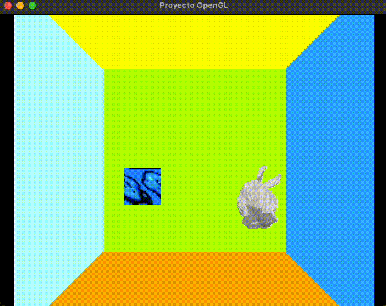

# Proyecto 2 de graficacion

Librerias Necesarias:

* OpenGL
* glu
* glew
* glm
* glut
* Qt
* qmake
* make

Para clonar el proyecto, hagalo con `git clone --recursive` para que los submodulos se inicialicen correctamente.

## Compliacion

```sh
qmake
make
./Proyecto
```

## Instrucciones de uso

Mover al Kirby:
<kbd> W A S D </kdb>


Cuando se acerca al objeto, se activa el shader


Para cambiar la iluminacion, presione la tecla
<kbd>L</kbd>

Mueva la rueda del mouse para hacer zoom en la escena.

Cambia el modelo obj con las tecla:
<kbd>1, 2</kbd> o <kbd>3</kbd>


## Ventajas y otras notas

Se penso en la disminucion de dependencias fuertes como lo es `QT` para que se pueda usar independientemente de la libreria que maneje el vewport.

Uso de header only libraries para minimizar instalaciones.
